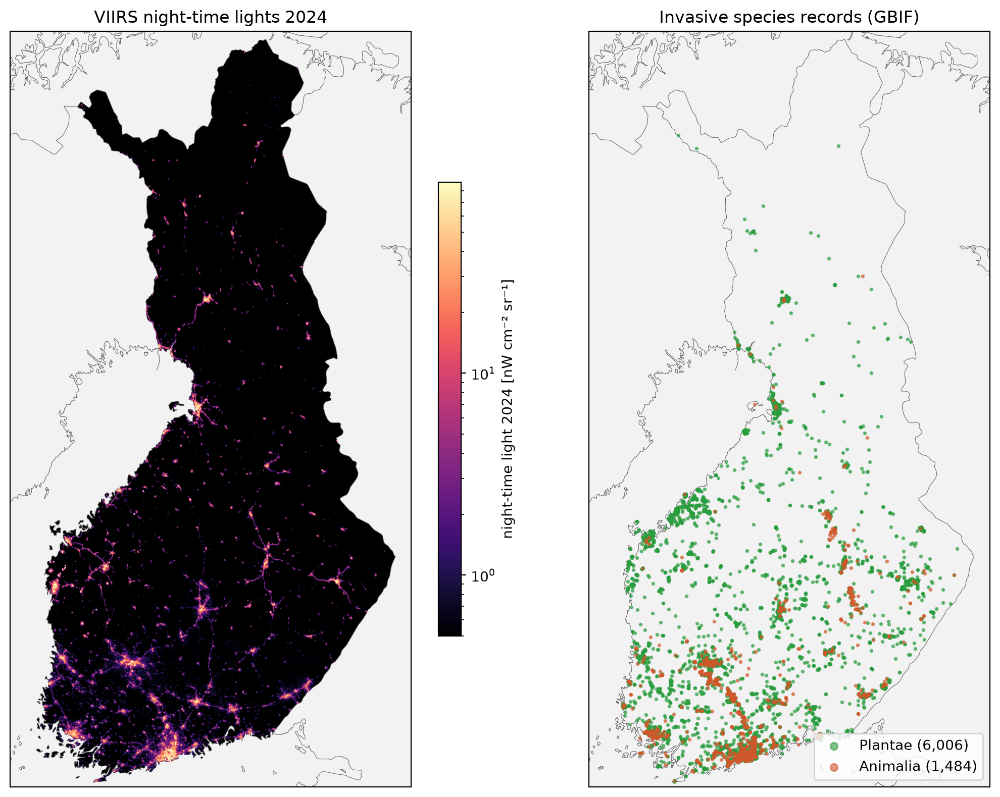

# Invasive alien species records and night-time lights in Finland

Jupyter notebook that tests whether observations of invasive alien species in Finland are linked to
night-time light intensity (VIIRS 2024), used as a proxy for human presence and activity.



## Method

1. Clip the global VIIRS Nighttime Lights 2024 annual composite (15 arc-seconds, nW cm⁻² sr⁻¹) to Finland.
2. Aggregate 7,788 GBIF records of invasive species observations onto the night-time light grid,
   per kingdom (Animalia, Plantae, combined), as number of records and as number of individuals.
3. In pixels with at least one record, correlate night-time light with the counts
   (Spearman ρ with bootstrap 95 % CI, Pearson on raw and log values).
4. Compare counts across night-time light classes (unlit, then quintiles of lit pixels) and fit
   quantile regressions (q = 0.1–0.9).
5. Compare the share of pixels holding any record across the same classes, using all pixels in Finland.

## Results

| Group | Occupied pixels | Spearman ρ (records) [95 % CI] | Spearman ρ (individuals) [95 % CI] |
|---|---:|---|---|
| Animalia | 973 | 0.02 [−0.04, 0.09] | 0.12 [0.06, 0.18] |
| Plantae | 4,452 | 0.09 [0.06, 0.12] | 0.07 [0.04, 0.10] |
| Combined | 5,290 | 0.09 [0.07, 0.12] | 0.09 [0.06, 0.12] |

- **Where records exist, counts are almost unrelated to brightness** (ρ ≤ 0.12). Pearson r on raw
  values is ≈ 0 because a few extreme counts dominate. Quantile regression slopes are close to zero
  at all quantiles.
- **Whether a pixel has any record depends strongly on brightness.** 0.03 % of unlit pixels hold
  a record, compared with 0.10 % to 4.3 % for the dimmest to brightest quintiles of lit pixels.
  That is about 140 times more often in the brightest quintile than in unlit pixels
  (`figures/occupancy_by_nightlight_class.png`).

The pattern is consistent with recording effort: people report species where they live and travel.
It is not evidence that invasive species themselves concentrate in bright areas. Separating the two
would need an effort correction, e.g. records of all species from the same platform as a background.
Further limitations are listed at the end of the notebook.

All tables are in `results/` and all figures in `figures/`.

## Running it

```bash
conda env create -f environment.yml
conda activate invasives-nightlight
jupyter lab Invasives_Nightlight_Finland.ipynb
```

Download the input data (see below) into `data/`, or change `DATA_DIR` in the configuration cell.
The data are not included in this repository. The night-time light file is a global raster of about
12 GB. Only the window covering Finland is read.

## Data sources

Please cite the original datasets if you reuse this work.

| Dataset | File | Citation |
|---|---|---|
| VIIRS Nighttime Lights (VNL) v2, annual 2024, *average_masked* | `VNL_npp_2024_global_vcmslcfg_v2_c202502261200.average_masked.dat.tif` | Elvidge, C.D., Zhizhin, M., Ghosh, T., Hsu, F.-C., Taneja, J. (2021). Annual time series of global VIIRS nighttime lights derived from monthly averages: 2012 to 2019. *Remote Sensing* 13(5), 922. https://doi.org/10.3390/rs13050922. Data: Earth Observation Group, Colorado School of Mines, https://eogdata.mines.edu/products/vnl/ |
| Finnish invasive species observations (GBIF occurrence download, tab-separated) | `invasive.csv` | Finnish Biodiversity Information Facility (FinBIF). Finnish invasive species observations. https://doi.org/10.15468/7bwhuf, accessed via GBIF.org. CC BY 4.0. <!-- TODO: add the DOI of your own GBIF download (shown on the download page) --> |
| Country boundary (Finland) | `fi_shape/fi.shp` | simplemaps, https://simplemaps.com <!-- TODO: product name and licence --> |
| Coastlines and borders (maps) | via Cartopy | Natural Earth, https://www.naturalearthdata.com (public domain) |

## License

<!-- TODO: choose a licence for the code (e.g. MIT) and add a LICENSE file -->
